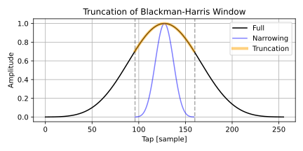
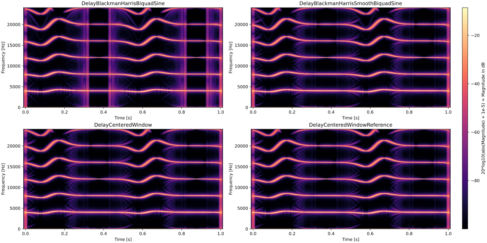

# Windowed Sinc フィルタの高速な計算
再帰的に sin を計算する方法を使った windowed sinc フィルタの高速な計算方法について紹介します。

ここではカットオフ周波数と群遅延が 1 サンプルごとに変更される応用を想定しています。以下は主な応用です。

- クロスオーバー周波数が可変のバンド分割
- ディレイ時間変更時のアンチエイリアシング
- 楽器のサンプラーの補間

ここで紹介する高速な計算方法を使うと計算精度は下がります。フィルタ係数を固定できるときには使わないでください。

検証に使ったすべてのコードは以下のリンクから閲覧できます。

- [記事の内容の検証に使ったコード (github.com)](https://github.com/ryukau/filter_notes/tree/master/fast_windowed_sinc)

## sinc 関数
通常、 sinc 関数は以下のような形で定義されています。

$$
\mathrm{sinc}(x) = \frac{\sin(\pi x)}{\pi x}.
$$

ここではローパスのカットオフ周波数 $f_c$ を考慮した以下の式を扱います。

$$
\mathrm{sinc}(x, f_c) = \frac{\sin(2 \pi f_c x)}{\pi x}.
$$

$f_c$ の単位は rad / 2π で、値の範囲が [0.0, 0.5] となるように正規化されてます。

以下は Python で素朴に実装した sinc 関数です。音のフィルタ設計ならこれでも十分です。

```python
def modifiedSincNaive(x, fc):
    if x == 0:
        return 2 * fc
    return np.sin(np.pi * 2 * fc * x) / (np.pi * x)
```

## 正確な実装
以下は矩形窓を用いた windowed sinc フィルタを設計する Python 3 のコードです。

```python
import numpy as np

def modifiedSinc(x, cutoff):
    u = 2 * fc * x
    theta = np.pi * u

    if abs(theta) < 0.32: # x = 0 付近はテイラー展開で近似。
        t2 = theta * theta

        y = -1.0 / 39916800.0
        y = y * t2 + (1.0 / 362880.0)
        y = y * t2 - (1.0 / 5040.0)
        y = y * t2 + (1.0 / 120.0)
        y = y * t2 - (1.0 / 6.0)
        y = y * t2 + 1.0

        return 2 * fc * y

    # レンジリダクション。
    k = np.rint(u)
    return (1 - 2 * (k % 2)) * np.sin(np.pi * (u - k)) / (np.pi * x)

def lowpassFir(length, cutoff, fractionSample):
    """
    `length`         : FIR フィルタのタップ数。
    `cutoff`         : 正規化されたカットオフ周波数。単位は rad / 2π 。範囲は [0, 0.5] 。
    `fractionSample` : サンプル数であらわされた小数点以下の群遅延の量。範囲は [0, 1] 。

    `fractionSample` の向きは、配列 `fir` のインデックスをさかのぼる方向に固定。
    """
    mid = fractionSample - (length // 2 + length % 2)
    fir = np.zeros(length)
    for i in range(length):
        x = i + mid
        fir[i] = modifiedSinc(x, cutoff)
    return fir
```

`modifiedSinc` のテイラー展開は以下の形をしています。

$$
\begin{aligned}
\mathrm{sinc}(x, f_c)
&\approx
2 f_c \sum_i (-1)^i \frac{(2 f_c \pi x)^{2i}}{(2 i + 1)!} \\
&=
2 f_c \left(
  1
  -\frac{u^{2}}{3!}
  +\frac{u^{4}}{5!}
  -\frac{u^{6}}{7!}
  +\frac{u^{8}}{9!}
  -\frac{u^{10}}{11!}
  \dots
\right), \quad u = 2 f_c \pi x.
\end{aligned}
$$

`modifiedSinc` では 0 の周りを広めにカバーするために 10 次のテイラー展開を使っています。[テイラー展開の誤差は近似式に現れない、最も次数の高い項から求められます](https://mathworld.wolfram.com/TaylorSeries.html)。したがってテイラー展開への分岐点は 12 次の項と、マシンイプシロン $\epsilon$ からなる以下の不等式を $u$ について解けば得られます。

$$
\dfrac{u^{12}}{13!} < \epsilon
$$

64-bit float では $\epsilon = 2^{-52}$ となり、不等式の解である $u < (13! \; \epsilon)^{1/12}$ に代入するとおよそ `0.32` となります。この広さは以降の高速な実装で役に立ちます。

レンジリダクションによって理論上は正確になります。まずは sinc 関数を再掲します。

$$
\mathrm{sinc}(x, f_c) = \frac{\sin(2 \pi f_c x)}{\pi x}.
$$

レンジリダクションが入るのは $\sin$ の引数です。まず、コードと同様にレンジリダクションする前の係数を $u = 2 f_c x$ と置きます。また、レンジリダクションされた値を $r = u - k$ と置きます。 $k$ はコード中の `k` と対応しています。そして、浮動小数点数であらわされた $\pi$ には丸め誤差 $\delta$ があるので $\pi \approx \pi + \delta$ となります。ここで $\sin$ の引数である $\pi u$ あるいは $\pi r$ に誤差を含めると以下のように書けます。

$$
\begin{aligned}
\pi u &\approx (\pi + \delta) u && = \pi u + \delta u. \\
\pi r &\approx (\pi + \delta) r && = \pi r + \delta r. \\
\end{aligned}
$$

ここで $r$ の定義より $|u| \geq |r|$ なので、 $|\delta u| \geq |\delta r|$  となり、 $|u| > |r|$ なら誤差が減ると言えます。

レンジリダクションを行うと `x = n / (2 * cutoff)` のときに 0 を出力するケースが増えます。厳密には浮動小数点によって丸められた `x = n / (2 * cutoff)` を `modifiedSinc` に代入しても 0 とはならないことがほとんどです。

## 高速な実装
以下は biquad オシレータと呼ばれる再帰的に sin を計算する方法を使った高速な実装です。見やすさのために Python で書いていますが、特に CPython では `for` が遅いので高速化の恩恵は薄いです。 C++ による実装は「[ディレイのアンチエイリアシング](#ディレイのアンチエイリアシング)」を参照してください。

`fractionSample` が 0 または 1 に近いときに `x == 0` の周りで値がおかしくなるので、テイラー展開への分岐は必須です。分岐の幅が `±0.32` と広いのはおかしくなる部分を完全にカバーするためです。

```python
def lowpassFirBiquad(length: int, cutoff: float, fractionSample: float):
    mid = fractionSample - length // 2 - length % 2

    omega = 2 * np.pi * cutoff
    k = 2 * np.cos(omega)
    u1 = np.sin((mid - 1) * omega)
    u2 = np.sin((mid - 2) * omega)

    fir = np.zeros(length)
    for i in range(length):
        u0 = k * u1 - u2
        u2 = u1
        u1 = u0

        x = i + mid
        theta = np.pi * 2 * cutoff * x
        if abs(theta) < 0.32:
            t2 = theta * theta

            y = -1.0 / 39916800.0
            y = y * t2 + (1.0 / 362880.0)
            y = y * t2 - (1.0 / 5040.0)
            y = y * t2 + (1.0 / 120.0)
            y = y * t2 - (1.0 / 6.0)
            y = y * t2 + 1.0
            fir[i] = 2 * cutoff * y
        else:
            fir[i] = u0 / (np.pi * x)
    return fir
```

### 誤差
`/fp:fast` や `-ffast-math` のような浮動小数点数の計算順序を入れ替えるコンパイラの最適化オプションを使うと誤差が変わります。

再帰的な sin の計算方法はいくつか種類があり、別記事の「 [sin, cos を反復的に計算するアルゴリズムのレシピ](../recursive_sine/recursive_sine.html)」にレシピを載せています。簡単に調べたところでは coupled form と呼ばれる形を使うと biquad よりは誤差が減ります。ただし、他のアルゴリズムに替えると biquad よりは遅くなります。また、 `lowpassFirBiquad` の `u1` と `u2` は「 sin, cos を反復的に計算するアルゴリズムのレシピ」とは式の形を変えて初期位相のずれによる誤差を減らしています。

ループ内の誤差について検討します。方針としては 1 サンプルごとの位相の進みを求めて、フィルタのタップ数 $N$ から誤差の蓄積を計算できるようにします。

まず、誤差の元となるのは `k` に加えられる丸め誤差です。真値を $k$ とします。 $\omega = 2 \pi f_c$ です。

$$
k = 2 \cos(\omega).
$$

$k$ の式より真の周波数 $\omega$ の式が得られます。

$$
\omega = \arccos\left(\frac{k}{2}\right).
$$

真の周波数 $\omega$ から誤差のある周波数を引いて、 1 サンプルあたりの位相の誤差 $\Delta \omega$ を求めます。誤差 $\epsilon$ を $k$ に加えています。

$$
\Delta \omega = \omega - \arccos\left( \frac{k + \epsilon}{2} \right).
$$

するとループカウンター $n$ から位相のずれを計算する式が得られます。

$$
\Delta \phi[n] = n \times \Delta \omega.
$$

$N$ を FIR フィルタのタップ数とすると以下の式でざっくりとした誤差の上限を計算できます。ざっくりというのは式中でマシンイプシロン $\epsilon$ としている値は、実際には $k$ の値に応じて変わる浮動小数点数の丸め誤差であり、一定ではないからです。

$$
\Delta \phi \approx N \times \left(
  \omega - \arccos\left( \cos(\omega) + \frac{\epsilon}{2} \right)
\right).
$$

よりざっくりとした相対誤差の計算は以下の式で行えます。 $N$ は FIR フィルタのタップ数です。

$$
\mathrm{relative\_error} \approx N \times \frac{\epsilon}{\sin(\omega)}.
$$

$k$ を $\omega$ について微分すると $\dfrac{d k}{d \omega} = -2 \sin(\omega)$ となり、微分演算子について $dk  = \epsilon$ と代入してしまえば $d \omega \approx \Delta \omega$ と近似できるというところから出てきています。

大まかな誤差を出します。 $f_c = \dfrac{ω}{2 π}$ で、コード中の `cutoff` と対応しています。 $\epsilon$ には 64-bit float のマシンイプシロンを代入しました。

|           | $f_c = 0.0005$ | $f_c = 0.005$ | $f_c = 0.05$ | $f_c = 0.5$ |
|-----------|----------------|---------------|--------------|-------------|
| $N = 4$   | 2.01e-13       | 1.96e-14      | 8.88e-16     | 5.96e-08    |
| $N = 8$   | 4.02e-13       | 3.92e-14      | 1.77e-15     | 1.19e-07    |
| $N = 16$  | 8.04e-13       | 7.84e-14      | 3.55e-15     | 2.38e-07    |
| $N = 32$  | 1.60e-12       | 1.56e-13      | 7.10e-15     | 4.76e-07    |
| $N = 64$  | 3.21e-12       | 3.13e-13      | 1.42e-14     | 9.53e-07    |
| $N = 128$ | 6.43e-12       | 6.27e-13      | 2.84e-14     | 1.90e-06    |
| $N = 256$ | 1.28e-11       | 1.25e-12      | 5.68e-14     | 3.81e-06    |

当然ですが $N$ が増えると誤差が増えています。 $f_c$ に対して U 字を描くような誤差となっています。ナイキスト周波数の $f_c = 0.5$ で誤差が多く、間の 0.05 ではやや誤差が下がり、 0.005 から 0.0005 に向けてまた誤差が増えています。 $f_c = 0.0005$ は可聴域の下限 20 Hz を音でよくあるサンプリング周波数の 48000 で除算した値に近いです (`20/48000 ~= 0.0004`) 。

<details>
<summary>テーブルの計算に使った Python スクリプト</summary>

```python
import numpy as np
def errorFastSinc(length, cutoff, epsilon=np.finfo(np.float64).eps):
    omega = 2 * np.pi * cutoff
    return length * (omega - np.arccos(np.cos(omega) + epsilon / 2))

length = np.array([4, 8, 16, 32, 64, 128, 256])
cutoff = np.array([5e-4, 5e-3, 5e-2, 5e-1])
for N in length:
    print(errorFastSinc(N, cutoff))
```

</details>

## Cosine-sum 窓
再帰的な sin の計算を行うオシレータを 1 つ増やすことで、 [cosine-sum 窓](https://en.wikipedia.org/wiki/Window_function#Cosine-sum_windows)と呼ばれる種類の窓関数を高速にかけることができます。ここでは cosine-sum 窓の 1 つである Blackman-Harris 窓について具体的な実装を紹介します。

以下は Blackman-Harris 窓の計算式です。

$$
\begin{aligned}
w[n]&=a_0 - a_1 \cos \left ( \frac{2 \pi n}{N} \right)+ a_2 \cos \left ( \frac{4 \pi n}{N} \right)- a_3 \cos \left ( \frac{6 \pi n}{N} \right),\\
a_0&=0.35875,\quad a_1=0.48829,\quad a_2=0.14128,\quad a_3=0.01168.
\end{aligned}
$$

- $n$: インデックス。
- $N$: 窓長。

この式は $\cos$ の位相が 2 倍、 3 倍となっているので、以下のように [Chebyshev 多項式](https://en.wikipedia.org/wiki/Chebyshev_polynomials) $T_k$ を使って書くことができます。 $T_k$ の中身は [Wikipedia の記事](https://en.wikipedia.org/wiki/Chebyshev_polynomials#First_kind)に掲載されています。

$$
\begin{aligned}
w[n] &= a_0 - a_1 T_1(c) + a_2 T_2(c) - a_3 T_3(c)\\
&\begin{aligned}
T_1(c) &= c\\
T_2(c) &= 2 c^2 - 1\\
T_3(c) &= 4 c^3 - 3c\\
\end{aligned}\qquad
c = \cos \left ( \frac{2 \pi n}{N} \right).
\end{aligned}
$$

三角関数の計算を $c$ の 1 回のみに減らすことができました。 Chebyshev 多項式を Maxima で展開します。

```maxima
T2: 2*c^2 - 1;
T3: 4*c^3 - 3*c;
w: 0.35875 - 0.48829 * c + 0.14128 * T2 - 0.01168 * T3;
ratsimp(w);
```

以下は整形した出力です。これで高速に計算できる形になりました。

$$
\begin{aligned}
w[n] &= 0.21747 - 0.45325 c + 0.28256 c^2 - 0.04672 c^3,\\
c    &= \cos \left ( \frac{2 \pi n}{N} \right).
\end{aligned}
$$

以下は Python 3 による Blackman-Harris 窓のみの実装です。ここでは windowed sinc フィルタの設計に使うので、左右対称な窓関数を計算しています。

```python
def blackmanHarris(length: int):
    isEven = 1 - length % 2

    ω = 2 * np.pi / float(length - isEven)
    k = 2 * np.cos(ω)
    u1 = np.cos(-1 * ω)  # k と cos の角度が重複しているので簡略化できる。
    u2 = np.cos(-2 * ω)

    window = np.zeros(length)
    for i in range(length):
        u0 = k * u1 - u2
        u2 = u1
        u1 = u0
        window[i] = 0.21747 + u0 * (-0.45325 + u0 * (0.28256 + u0 * -0.04672))
    return window
```

以下は windowed sinc フィルタの設計と同時に Blackman-Harris 窓をかける実装です。上の `blackmanHarris` と、下の `lowpassBlackmanHarrisBiquad` では、窓関数の計算に使うオシレータの `omega, u1, u2` の初期化が異なっています。 `blackmanHarris` は定義通りに計算しているので窓の両端が 0 になりますが、これだと以下で紹介するディレイのアンチエイリアシングへの応用で `length <= 2` のときに音が止まってしまうので、下では変えています。

```python
def lowpassBlackmanHarrisBiquad(length: int, cutoff: float, fractionSample: float):
    isEven = 1 - length % 2

    mid = fractionSample - (length // 2 + length % 2)

    o1_omega = 2 * np.pi * cutoff
    o1_phi = mid * o1_omega
    o1_k = 2 * np.cos(o1_omega)
    o1_u1 = np.sin((mid - 1) * o1_omega)
    o1_u2 = np.sin((mid - 2) * o1_omega)

    o2_omega = 2 * np.pi / float(length + isEven)
    o2_k = 2 * np.cos(o2_omega)
    o2_u1 = np.cos((isEven + fractionSample - 1) * o2_omega)
    o2_u2 = np.cos((isEven + fractionSample - 2) * o2_omega)

    fir = np.zeros(length)
    for i in range(length):
        o1_u0 = o1_k * o1_u1 - o1_u2
        o1_u2 = o1_u1
        o1_u1 = o1_u0

        o2_u0 = o2_k * o2_u1 - o2_u2
        o2_u2 = o2_u1
        o2_u1 = o2_u0

        x = i + mid
        theta = np.pi * 2 * cutoff * x
        if abs(theta) < 0.32:
            t2 = theta * theta

            y = -1.0 / 39916800.0
            y = y * t2 + (1.0 / 362880.0)
            y = y * t2 - (1.0 / 5040.0)
            y = y * t2 + (1.0 / 120.0)
            y = y * t2 - (1.0 / 6.0)
            y = y * t2 + 1.0
            fir[i] = 2 * cutoff * y
        else:
            fir[i] = o1_u0 / (np.pi * x)

        window = 0.21747 + o2_u0 * (-0.45325 + o2_u0 * (0.28256 + o2_u0 * -0.04672))
        fir[i] *= window
    return fir
```

### 他の cosine-sum 窓
他の cosine-sum 窓について、 Chebyshev 多項式を展開して [Horner's method](https://en.wikipedia.org/wiki/Horner%27s_method) の形にした式を掲載します。

SymPy で式変形を行います。

```python
import sympy
from sympy.polys.orthopolys import chebyshevt_poly
from sympy.polys.polyfuncs import horner

cosineSumWindowCoefficients = {
    "blackman": [7938 / 18608, 9240 / 18608, 1430 / 18608],
    "nuttall": [0.355768, 0.487396, 0.144232, 0.012604],
    "blackmannuttall": [0.3635819, 0.4891775, 0.1365995, 0.0106411],
    "blackmanharris": [0.35875, 0.48829, 0.14128, 0.01168],
    "flattop": [0.21557895, 0.41663158, 0.277263158, 0.083578947, 0.006947368],
}

u0 = sympy.symbols("u0")
for key, a_ in cosineSumWindowCoefficients.items():
    expr = 0
    for i in range(len(a_)):
        expr += (-1) ** i * a_[i] * chebyshevt_poly(i, x=u0)
    print(f"{key} = {horner(expr)}")
```

以下は出力です。検証を楽にするために整理せずに掲載しています。 `u0` は上に掲載している `blackmanharrisBiquad` で使われている変数と同じで $\cos(2\pi n /N)$ が入ります。 $n$ はインデックス、 $N$ はサンプル数で表された窓長です。

```python
blackman = u0*(0.153697334479794*u0 - 0.496560619088564) + 0.349742046431642
nuttall = u0*(u0*(0.288464 - 0.050416*u0) - 0.449584) + 0.211536
blackmanharris = u0*(u0*(0.28256 - 0.04672*u0) - 0.45325) + 0.21747
blackmannuttall = u0*(u0*(0.273199 - 0.0425644*u0) - 0.4572542) + 0.2269824
flattop = u0*(u0*(u0*(0.055578944*u0 - 0.334315788) + 0.498947372) - 0.165894739) - 0.05473684
```

Chebyshev 多項式の次数が高いときは [Clenshaw アルゴリズム](https://en.wikipedia.org/wiki/Clenshaw_algorithm#Special_case_for_Chebyshev_series)を使うほうが高精度に計算できます。ただし演算数が増えるので、上記の次数の低い cosine-sum 窓であれば Horner's method で十分です。 Clenshaw アルゴリズムの実装は [chebfun の Matlab 実装](https://github.com/chebfun/chebfun/blob/master/%40chebtech/clenshaw.m)が参考になります。

## ディレイのアンチエイリアシング
高速な windowed sinc フィルタの計算を応用して、ディレイの時間変更時に生じるエイリアシングを低減します。

### 仕組み
大まかなアイデアとしては 1 サンプルごとに変換レートが変わるダウンサンプラーを実装します。

ここでは音の信号を扱うので 0 Hz からナイキスト周波数まで周波数成分が詰め込まれていることにします。

ディレイ時間の変化は 2 つに場合分けできます。

1. ディレイ時間の伸長。 1 倍速よりも遅い読み取り。低いほうへのピッチシフト。
2. ディレイ時間の短縮。 1 倍速よりも速い読み取り。高いほうへのピッチシフト。

1 のときは通常の分数ディレイフィルタ (fractional delay fitler) による補間で十分です。分数ディレイフィルタとは、カットオフがナイキスト周波数に固定されており、群遅延の大きさを与えると設計できるフィルタのことです。

2 のときはピッチシフトによってナイキスト周波数を超える周波数成分が現れます。これを抑えるために、カットオフを変更できる分数ディレイフィルタが必要です。また、ディレイ時間が変わるということは読み取り時刻の逆走もあり得ます。

以上より、補間に使うフィルタには以下が求められます。

- 時間の逆走への対応
- 非整数サンプルの補間
- カットオフ周波数が可変

素朴に畳み込む windowed sinc フィルタはこれらの要件に対応できます。素朴に畳み込むということは、読み取り時刻の周りのサンプルだけを使って計算できるので逆走に対応できます。また windowed sinc フィルタは補間位置 (群遅延) とカットオフ周波数を容易に変更できます。

### カットオフ周波数の設定
ローパスフィルタのカットオフ周波数は、ディレイ時間の変化によるピッチシフトの量から設定できます。以降ではピッチシフトの量のことを単にピッチと呼びます。

ピッチは以下の式で計算できます。

$$
p = d_1 - d_0 + 1.
$$

- $p$ : ピッチ。比率で表された信号の読み取り速度。
- $d_0$ : 現在のディレイ時間。単位はサンプル数。
- $d_1$ : 1 サンプル前のディレイ時間。単位はサンプル数。

ここでのディレイ時間は、ある時点からの相対的な時間です。 $d_0$ と $d_1$ はディレイ時間の起点が 1 サンプルずれているので注意してください。この定義であればピッチ $p$ の値をそのまま使って $p$ 倍速という表現ができます。例えば:

- $d_1$ が 100 、 $d_0$ が 99 なら、ピッチは 2 倍速。
- $d_1$ が 100 、 $d_0$ が 100 なら、ピッチは 1 倍速。
- $d_1$ が 100 、 $d_0$ が 101 なら、ピッチは 0 倍速。
- $d_1$ が 100 、 $d_0$ が 102 なら、ピッチは -1 倍速。

以下は記号の定義を示した図です。

<figure>

</figure>

アンチエイリアシングの実装ではピッチの絶対値をカットオフ周波数として使います。

$$
f_c = \begin{cases}
f_s / 2      & \text{if}\ |p| \leq 1 \\
f_s 2^{-|p|} & \text{otherwise.} \\
\end{cases}
$$

- $f_c$: カットオフ周波数。
- $f_s$: サンプリング周波数。

フィルタ設計時のサンプリング周波数を 1 にしてしまえば $f_s$ の乗算を省略できます。

### 短いディレイ時間への対応
Windowed sinc フィルタの長さを固定すると、安定してノイズの少ない出力が得られますが、フィルタの長さの半分よりも短いディレイ時間が指定できなくなります。

短いディレイ時間を設定したいときは、与えられたディレイ時間に応じてフィルタの長さを短くする仕組みが必要です。このとき、 1 サンプル単位でフィルタの長さを変えることも可能ですが、試した範囲では偶数長と奇数長のフィルタを混ぜるとノイズが増えました。よって、以下で紹介している実装ではフィルタの長さを偶数長に固定しています。

### フィードバックコムフィルタ向きの窓関数
フィードバックコムフィルタへの応用では振幅特性が 0 dB を超えていると、フィードバックゲインによっては発振します。高速に計算できる窓関数の向き、不向きを以下に示します。

- 利用可: 三角, Blackman-Harris, Blackman-Nuttall, Nuttall, Flat top.
- 不向き: 矩形, Blackman, Hamming, Hann, Lanczos, Welch.

三角窓は振幅特性がほぼ確実に 0 dB を下回るので安定を優先するときは選択肢になります。他の利用可の窓は振幅特性の通過域がほぼフラットになり、音への応用であればどれも似たような特性です。

### 実装
以下は高速な windowed sinc フィルタの計算を応用した、アンチエイリアシングされたディレイの実装です。 Blackman-Harris 窓を使っています。 Windowed sinc フィルタの長さは偶数に固定しています。 CPU 負荷を減らしたいときは `maxTap` を適当な偶数に減らしてください。

```c++
template<typename Real, int maxTap = 256> class DelayAntialiasedCentered {
private:
  static_assert(maxTap > 0 && maxTap % 2 == 0);

  static constexpr int minTimeSample = maxTap / 2 - 1;

  Real maxTime = 0;
  Real prevTime = 0;
  int wptr = 0;
  std::vector<Real> buf{maxTap, Real(0)};

public:
  void setup(Real maxTimeSample)
  {
    maxTime = maxTimeSample;
    buf.resize(std::max(size_t(maxTap), size_t(maxTime) + maxTap / 2 + 1));
  }

  void reset()
  {
    prevTime = 0;
    wptr = 0;
    std::fill(buf.begin(), buf.end(), Real(0));
  }

  Real process(Real input, Real timeInSample)
  {
    const int size = int(buf.size());

    // Write to buffer.
    if (++wptr >= size) wptr = 0;
    buf[wptr] = input;

    // Shorten FIR filter to some even number length depending on `timeInSample`.
    const int localTap = std::clamp(2 * int(timeInSample), int(2), maxTap);
    const int halfTap = localTap / 2;
    const Real clamped = std::clamp(timeInSample, Real(halfTap - 1), maxTime);

    // Set cutoff frequency.
    const Real timeDiff = std::abs(prevTime - clamped + Real(1));
    prevTime = clamped;
    const Real cutoff = timeDiff <= Real(1) ? Real(0.5) : std::exp2(-timeDiff);

    // Early exit for bypass (0 sample delay) case.
    if (timeInSample <= 0) return input * Real(2) * cutoff;

    const int timeInt = int(clamped);
    const Real fraction = clamped - Real(timeInt);
    const Real mid = fraction - halfTap;

    // Setup oscillator 1 for windowed sinc lowpass.
    constexpr Real pi = std::numbers::pi_v<Real>;
    const Real o1_omega = Real(2) * pi * cutoff;
    const Real o1_k = Real(2) * std::cos(o1_omega);
    Real o1_u1 = std::sin((mid - Real(1)) * o1_omega);
    Real o1_u2 = std::sin((mid - Real(2)) * o1_omega);

    // Setup oscillator 2 for cosine-sum window function.
    const Real o2_omega = Real(2) * pi / Real(maxTap + 1);
    const Real o2_phi = o2_omega * Real(maxTap / 2 - halfTap);
    const Real o2_k = Real(2) * std::cos(o2_omega);
    Real o2_u1 = std::cos(o2_phi + o2_omega * (Real(-1) + fraction));
    Real o2_u2 = std::cos(o2_phi + o2_omega * (Real(-2) + fraction));

    // The rest is convolution.
    int rptr = wptr - timeInt - halfTap;
    if (rptr < 0) rptr += size;

    Real sum = 0;
    const Real theta_scale = Real(2) * cutoff * pi;
    for (int i = 0; i < localTap; ++i) {
      const Real o1_u0 = o1_k * o1_u1 - o1_u2;
      o1_u2 = o1_u1;
      o1_u1 = o1_u0;

      const Real o2_u0 = o2_k * o2_u1 - o2_u2;
      o2_u2 = o2_u1;
      o2_u1 = o2_u0;

      const Real window = Real(0.21747)
        + o2_u0 * (Real(-0.45325) + o2_u0 * (Real(0.28256) + o2_u0 * Real(-0.04672)));

      const Real x = Real(i) + mid;
      const Real theta = theta_scale * x;
      Real sinc;
      if (std::abs(theta) <= Real(0.32)) [[unlikely]] {
        const Real t2 = theta * theta;

        Real y = Real(-1.0 / 39916800.0);
        y = y * t2 + Real(+1.0 / 362880.0);
        y = y * t2 + Real(-1.0 / 5040.0);
        y = y * t2 + Real(+1.0 / 120.0);
        y = y * t2 + Real(-1.0 / 6.0);
        y = y * t2 + Real(+1.0);

        sinc = Real(2) * cutoff * y;
      } else {
        sinc = o1_u0 / (pi * x);
      }
      sum += sinc * window * buf[rptr];
      if (++rptr >= size) rptr = 0;
    }
    return sum;
  }
};

```

以下は簡単な使用例です。

```c++
auto processDelay(const std::vector<double> &in, const std::vector<double> &timeInSample) {
  DelayAntialiasedCentered<double> delay;
  delay.setup(48000);

  std::vector<double> out{in.size(), double(0)};
  for (size_t i = 0; i < in.size(); ++i) out[i] = delay.process(in[i], timeInSample[i]);
  return out;
}
```

以下は他の補間方法とエイリアシングノイズを比較したスペクトログラムのプロットです。小さいときは Ctrl + マウスホイールなどで拡大してください。

<figure>

</figure>

入力信号は 4000 Hz ののこぎり波で、ディレイ時間は sin で変調しています。大まかには縦方向に沿って明るい部分が多いほど、エイリアシングノイズが多いと言えます。

左上が補間なし、中央上が線形補間、右上が 3 次ラグランジュ補間で、この 3 つはエイリアシングが出ていることがはっきりとわかります。下の 3 つは高速な windowed sinc フィルタの計算を応用した実装の結果で、左下は矩形窓、中央下は三角窓、右下は Blackman-Harris 窓 (上記の C++ 実装) です。矩形窓は横線がうねっている部分でのエイリアシングがぼんやりと見えますが、他の 2 つの窓とは異なり、縦の明るい線が見られません。縦の明るい線はフィルタの長さが切り替わるときに生じるポップノイズです。したがって、常にディレイ時間が変わり続けるときは矩形窓にも利点があると考えられますが、前述のようにフィードバックコムフィルタへの応用では通過域のリップルによるフィードバックゲインの制限がかかります。

以下のコードを実行した結果からプロットしました。

- [アンチエイリアシングを施したディレイの C++ 実装 (github.com)](https://github.com/ryukau/filter_notes/blob/master/fast_windowed_sinc/delay/delay.cpp)

### フィルタの長さが変わるときのノイズの低減
窓関数のオシレータを素朴に実装すると以下のように書けます。この形だとフィルタの長さ `localTap` に応じて窓関数を狭めます。

```c++
// Setup oscillator 2 (o2). Cosine-sum window.
const Real o2_omega = Real(2) * pi / Real(localTap + 1);
const Real o2_phi = pi / Real(2);
const Real o2_k = Real(2) * std::cos(o2_omega);
Real o2_u1 = Real(1);
Real o2_u2 = std::sin(o2_phi - o2_omega);
```

以下のようにオシレータの初期設定を変更するとフィルタの長さが変わるときのノイズを減らせます。 `maxTap >= localTap` かつ `halfTap = localTap / 2` です。

```c++
const Real o2_omega = Real(2) * pi / Real(maxTap + 1);
const Real o2_phi = o2_omega * Real(maxTap / 2 - halfTap);
const Real o2_k = Real(2) * std::cos(o2_omega);
Real o2_u1 = std::cos(o2_phi);
Real o2_u2 = std::cos(o2_phi - o2_omega);
```

上の変更を行うとフィルタの長さが変わるときに窓関数の中央付近だけに切り詰めるようになります。以下は窓関数の切り詰めを示した図です。

<figure>

</figure>

以下のように窓関数ピークを sinc 関数のピークにあわせるようなチューニングもノイズ低減に使えます。

```c++
Real o2_u1 = std::cos(o2_phi + o2_omega * (Real(-1) + fraction));
Real o2_u2 = std::cos(o2_phi + o2_omega * (Real(-2) + fraction));
```

以下はフィルタの長さが変わるときの窓関数の扱いを変えたときのエイリアシングの違いを示したスペクトログラムです。

<figure>

</figure>

- 左上: 窓関数を狭める実装。
- 右上: 窓関数を切り詰めてピークを固定。
- 左下: 窓関数を切り詰めてピークを sinc に追従。
- 右上: 窓関数を切り詰めてピークを sinc に追従。 C++ 標準ライブラリの sin と cos を使用。

窓関数を狭める実装は縦の明るい線が目立つので、ディレイ時間が短いときに変調によってポップノイズが乗りやすいことが見て取れます。窓関数を切り詰めると縦線が減っているのでポップノイズは減っていますが、エイリアシングは増えています。ピークを固定するとポップノイズが最も減ります。ピークを sinc に追従させるとエイリアシングが最も減りますが、ややポップノイズが増えます。 80 dB ほどの S/N かつ `double` で計算するなら、 biquad オシレータと標準数学関数の間で差は見られません。タップ数が 256 のときは最悪のケースで 1e-10 ほどの相対誤差が出るので、ダイナミックレンジが 200 dB を超えるようなときは標準ライブラリを使う必要が出てきます。

## 参考サイト
- [Window function - Wikipedia](https://en.wikipedia.org/wiki/Window_function)
- [fft - When to use symmetric vs asymmetric (periodic) window functions? - Signal Processing Stack Exchange](https://dsp.stackexchange.com/questions/95448/when-to-use-symmetric-vs-asymmetric-periodic-window-functions)

## 変更点
- 2025/11/22
  - 「フィルタの長さが変わるときのノイズの低減」の節を追加。
